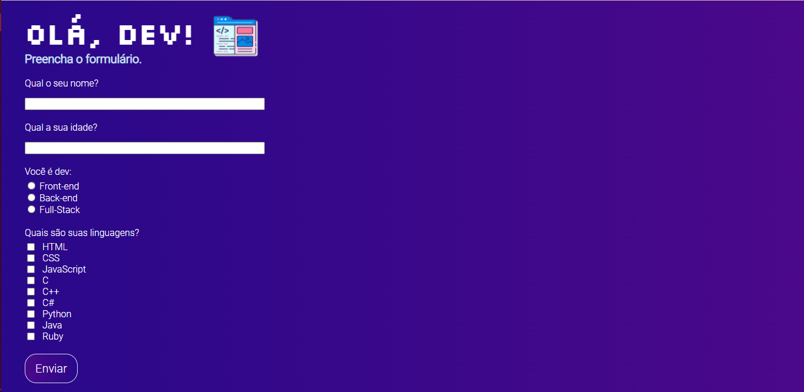

## Olá dev!

 

### Projeto: Formulário

 

<a href="(link)" style="color: #8904B1">🔗 Link para o formulário</a>

 

> Ilustração:

 

 

#

> Tecnologias usadas:

 

    
    

 

#

> Criado por:

 

